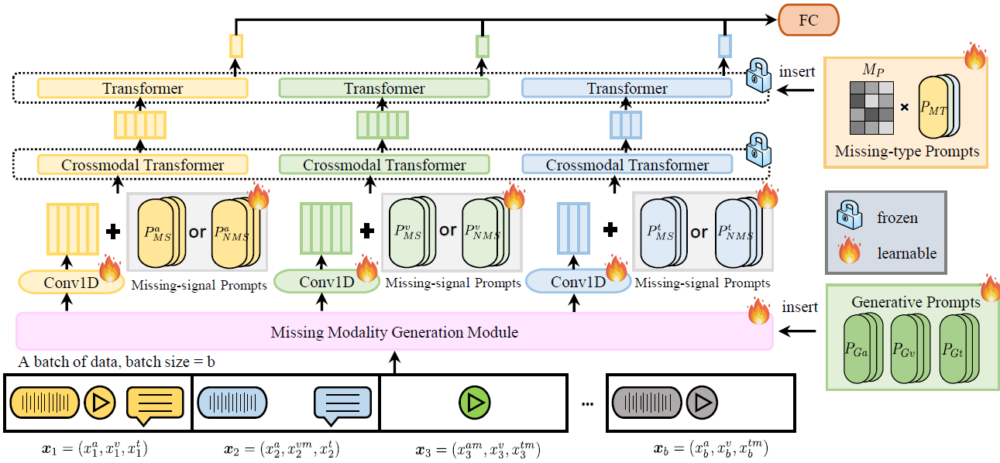

# Multimodal Prompt Learning with Missing Modalities for Sentiment Analysis and Emotion Recognition

## Introduction

The development of multimodal models has significantly advanced multimodal sentiment analysis and emotion recognition. However, in real-world applications, the presence of various missing modality cases often leads to a degradation in the model's performance. In this work, we propose a novel multimodal Transformer framework using prompt learning to address the issue of missing modalities. Our method introduces three types of prompts: generative prompts, missing-signal prompts, and missing-type prompts. These prompts enable the generation of missing modality features and facilitate the learning of intra- and inter-modality information. Through prompt tuning, we achieve a substantial reduction in the number of trainable parameters. Extensive experiments and ablation studies are conducted to demonstrate the effectiveness and robustness of our method, showcasing its ability to effectively handle missing modalities. 

## Acknowledgements

This code is based on the backbone [MulT](https://github.com/yaohungt/Multimodal-Transformer).