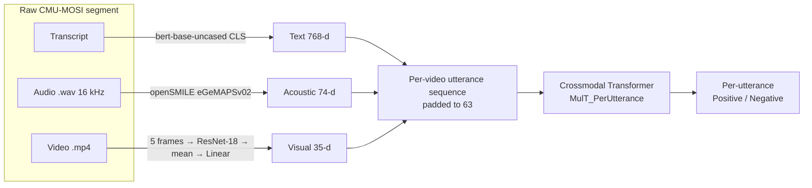

# Spatially-Enriched, Retrieval-Augmented and Expert-Specialized Missing-Modality Generation for Multimodal Sentiment Analysis

> Course project — Machine Learning, Semester 5, **Indian Institute of Technology Bhilai**

This repository contains the code and project materials for extending
**MPLMM** (*Multimodal Prompt Learning with Missing Modalities for Sentiment Analysis and Emotion Recognition*, Guo et al., ACL 2024).
The goal is to make multimodal sentiment analysis robust when one or more modalities (text, audio, video) are missing, through three improvements:

1. **2D spatial feature convolution:** keep facial spatial structure before the visual stream is reduced to a feature vector.
2. **Retrieval-augmented reconstruction (RAG):** supply relevant complete training examples as extra context when generating a missing modality. **Residual RAG** is explored as an extension that corrects reconstruction errors.
3. **Direct Mixture-of-Experts Missing-Modality Generator (MoE-MMGM):** replace the single generator with specialised experts combined by a learned router.

The current code provides an end-to-end **tri-modal sentiment pipeline on CMU-MOSI**. It covers raw-data feature extraction, a crossmodal transformer (MulT-style) baseline, training and evaluation, and an inference pipeline that runs on any raw video. This pipeline is the foundation that the components above will be built on.

---

## Table of Contents

- [Project Status](#project-status)
- [Repository Structure](#repository-structure)
- [Background](#background)
- [Pipeline Overview](#pipeline-overview)
  - [1. Feature Extraction](#1-feature-extraction)
  - [2. Labels and Alignment](#2-labels-and-alignment)
  - [3. Data Splits and Batching](#3-data-splits-and-batching)
  - [4. Model Architecture](#4-model-architecture)
  - [5. Training](#5-training)
  - [6. Inference on Raw Video](#6-inference-on-raw-video)
- [Results](#results)
- [Getting Started](#getting-started)
- [Configuration](#configuration)
- [Proposed Methodology](#proposed-methodology)
- [Ablation Plan](#ablation-plan)
- [Known Limitations](#known-limitations)
- [Team](#team)
- [References](#references)
- [License](#license)

---

## Project Status

| Stage | Component | Status |
|---|---|---|
| 0 | Raw CMU-MOSI feature extraction (BERT / openSMILE / ResNet-18) | ✅ Implemented |
| 0 | Tri-modal crossmodal transformer baseline, per-utterance classification | ✅ Implemented |
| 0 | Raw-video inference (Whisper ASR + silence-based segmentation) | ✅ Implemented |
| 0 | Modality-dropping hook (zero-filling selected modalities) | ✅ Implemented |
| 1 | Full MPLMM reproduction (generative / missing-signal / missing-type prompts, MMGM) | 🔲 Planned |
| 2 | 2D spatial CNN visual front-end | 🔲 Planned |
| 3 | Retrieval-augmented MMGM | 🔲 Planned |
| 4 | Residual RAG (exploratory) | 🔲 Planned |
| 5 | Direct MoE-MMGM | 🔲 Planned |

The full research plan is in [proposal.pdf](proposal.pdf).

---

## Repository Structure

```
mplmm-project/
├── notebooks/
│   └── cmu-mosi-multi-modal-sentiment-analysis.ipynb   # End-to-end pipeline (Kaggle notebook)
├── configs/
│   └── config.pkl          # Model hyperparameters saved by the training run
├── proposal.pdf            # Project proposal: motivation, methodology, ablation design
├── LICENSE                 # MIT License
└── README.md
```

| File | Description |
|---|---|
| [notebooks/cmu-mosi-multi-modal-sentiment-analysis.ipynb](notebooks/cmu-mosi-multi-modal-sentiment-analysis.ipynb) | The full pipeline: feature extraction from raw CMU-MOSI audio/video/transcripts, label alignment, dataset construction, model definition, training, evaluation, checkpoint export, and raw-video inference. |
| [configs/config.pkl](configs/config.pkl) | Pickled `dict` of the hyperparameters needed to rebuild the trained model for inference (see [Configuration](#configuration)). |
| [proposal.pdf](proposal.pdf) | Project proposal with architecture diagrams for each proposed component and the planned ablation study. |

> **Note:** Trained weights (`model_weights.pt`, `vis_proj_weights.pt`) are produced by the notebook in `/kaggle/working/mult_saved/` and are **not** committed to this repository.

---

## Background

**Multimodal Sentiment Analysis (MSA)** predicts the sentiment of an utterance by combining what is *said* (text), *how* it is said (audio), and *what is seen* (facial expression and gesture). In practice, inputs are often incomplete: a microphone fails, the face is occluded, or no transcript is available.

**MPLMM** handles this with a **Missing Modality Generation Module (MMGM)** that reconstructs the missing modality from the available ones using learnable *generative prompts*. For example, with audio missing:

$$\hat{x}_A = G\left(x_V,\; x_T,\; P_G^A\right)$$

The reconstructed representation is passed to a **Multimodal Transformer (MulT)** together with *missing-signal* and *missing-type* prompts. This project uses MPLMM as its reference baseline and addresses three of its limitations (see [Proposed Methodology](#proposed-methodology)).

---

## Pipeline Overview



### 1. Feature Extraction

Features are extracted from the **raw** CMU-MOSI release (93 videos, 2,199 segmented utterances) instead of the standard pre-computed SDK features.

| Modality | Extractor | Details | Dim |
|---|---|---|---|
| **Text** | `bert-base-uncased` (Hugging Face) | `[CLS]` token of the last hidden state; max 64 tokens | 768 |
| **Acoustic** | openSMILE `eGeMAPSv02` functionals | 88 utterance-level functionals truncated to the first 74, matching the COVAREP dimension used by MPLMM | 74 |
| **Visual** | ImageNet-pretrained ResNet-18 | 5 frames sampled uniformly → 224×224 → 512-d pooled embeddings → mean over frames → linear projection 512 → 35 (matches the FACET dimension) | 35 |

Missing or unreadable files fall back to a zero vector of the correct dimension. Segment IDs (`<video_id>_<segment_index>`, e.g. `03bSnISJMiM_1`) are matched across all three modalities. All 2,199 segments align.

### 2. Labels and Alignment

Continuous sentiment scores in **[-3, +3]** are taken from a pre-packaged CMU-MOSI pickle (`mosi_data.pkl`, Kaggle dataset `reganwillis/cmu-mosi`) and joined on segment ID. They are binarised as:

- **Positive (1):** score ≥ 0 (1,176 utterances)
- **Negative (0):** score < 0 (1,023 utterances)

### 3. Data Splits and Batching

- **Video-level split:** videos are shuffled with seed 42 and split 65% / 10% / 25%. No speaker or video appears in more than one split.

  | Split | Videos | Utterances |
  |---|---|---|
  | Train | 60 | 1,412 |
  | Valid | 9 | 206 |
  | Test | 24 | 581 |

- **One sample = one video.** Utterances are ordered by segment index and zero-padded to `MAX_UTT = 63` (the longest video). Videos have 9–63 utterances, mean 23.6.
- Padded positions get label `-1` and are excluded from the loss and from metrics.
- Batch size: 8 videos.

### 4. Model Architecture

`MulT_PerUtterance` is a crossmodal transformer in the style of MulT (Tsai et al., 2019). It classifies every utterance in a video sequence.

```
          ┌─ Linear → LayerNorm → Dropout(0.2) ─┐      T (B, U, 64)
text  ────┤                                     │
visual ───┤  Linear → LayerNorm → Dropout(0.5)  │      V (B, U, 64)
acoustic ─┤  Linear → LayerNorm → Dropout(0.5)  │      A (B, U, 64)
          └─────────────────────────────────────┘
                              │
     Crossmodal blocks (query ← key/value), 6 total:
       T ← A,  T ← V   → concat → t_fused (128)
       V ← T,  V ← A   → concat → v_fused (128)
       A ← T,  A ← V   → concat → a_fused (128)
                              │
     Self-attention TransformerEncoder (1 layer, d=128) per stream
                              │
     concat[t_out, v_out, a_out, T]   (7 × 64 = 448)   ← residual text skip
                              │
     Dropout → Linear(448, 64) → ReLU → Linear(64, 2)
                              │
                 logits (B, U, 2)  per utterance
```

Each **crossmodal block** is multi-head attention (`target` as query, `source` as key/value), then Add & LayerNorm, a 2× feed-forward network, and Add & LayerNorm again.

Design choices aimed at a small dataset:
- A small shared width (`d = 64`) and 2 attention heads limit capacity.
- Heavier dropout on the noisier visual and acoustic projections (0.5) than on text (0.2).
- A **residual text bypass** feeds the projected text stream straight to the classifier, because text is the strongest single modality on MOSI.

### 5. Training

| Setting | Value |
|---|---|
| Loss | Cross-entropy over non-padded utterances |
| Optimiser | AdamW, lr `1e-4`, weight decay `1e-2` |
| LR schedule | Cosine annealing (`T_max = 50`, `eta_min = 1e-6`) |
| Gradient clipping | max-norm 1.0 |
| Max epochs | 50 |
| Early stopping | patience 10 on validation loss; best checkpoint restored |
| Seed | 42 (Python, NumPy, PyTorch, CUDA) |

`train_mult_model(mods=[...])` takes the list of **available modalities**. Any modality left out is replaced with zeros at train and test time, which simulates missing modalities for robustness experiments.

### 6. Inference on Raw Video

`predict_video_sentiment(video_path)` runs the trained model on an arbitrary video:

1. **ASR:** OpenAI Whisper (`small`) transcribes the full audio with word-level timestamps.
2. **Segmentation:** ffmpeg `silencedetect` finds speech regions (noise floor −35 dB, min silence 0.35 s). Gaps ≤ 0.6 s are merged, segments shorter than 0.3 s are dropped, and anything longer than 30 s is split.
3. **Per-segment features:** the same BERT / openSMILE / ResNet-18 extractors as in training. Each transcript is built from the Whisper words whose midpoint falls inside the segment.
4. **Sliding-window prediction:** windows of 63 utterances with stride 31. Overlapping softmax probabilities are averaged.
5. **Output:** a per-segment table (time span, transcript, label, confidence) and an overall video label from summed class probabilities.

Example output:

```
  SEG            TIME        PRED     CONF  TRANSCRIPT
    1     0.0s-26.05s    Negative    90.3%  A question I'm often asked is, what is the
    2   26.05s-52.11s    Negative    69.2%  burned in my psyche, like some kind of fev
    3   52.75s-69.22s    Negative    59.0%  something like that. Maybe that made sense
    4    69.22s-85.7s    Positive    75.4%  and Let's Be Evil. And that night on strea
  OVERALL  ->  Negative  (60.8% confidence)
```

---

## Results

Tri-modal (text + visual + acoustic) binary sentiment classification on the held-out test split (24 videos, 581 utterances). Single run, seed 42. Early stopping triggered at epoch 29 (best validation loss 0.518).

| Metric | Value |
|---|---|
| **Accuracy (Acc-2)** | **79.52%** |
| Macro F1 | 0.793 |
| Weighted F1 | 0.796 |

| Class | Precision | Recall | F1 | Support |
|---|---|---|---|---|
| Negative | 0.750 | 0.794 | 0.772 | 253 |
| Positive | 0.834 | 0.796 | 0.814 | 328 |

**Confusion matrix** (rows = true, columns = predicted):

|  | Pred. Negative | Pred. Positive |
|---|---|---|
| **True Negative** | 201 | 52 |
| **True Positive** | 67 | 261 |

> These numbers use a custom video-level split and features extracted from raw data. They are **not directly comparable** to published CMU-MOSI benchmarks, which use the official SDK split and features (see [Known Limitations](#known-limitations)).

---

## Getting Started

### Environment

The notebook was developed and run on **Kaggle** (NVIDIA Tesla T4, Python 3.12, PyTorch 2.9.0 + CUDA 12.6). The proposal targets any NVIDIA GPU with roughly 8–12 GB VRAM and at least 16 GB of system RAM.

### Dependencies

```bash
pip install torch torchvision transformers scikit-learn numpy pandas matplotlib tqdm \
            opencv-python opensmile librosa openai-whisper
# ffmpeg is required for raw-video inference
sudo apt-get install -y ffmpeg
```

### Data

The notebook expects these Kaggle datasets to be attached:

| Kaggle dataset | Used for | Path in notebook |
|---|---|---|
| `mathurinache/cmu-mosi` | Raw transcripts, 16 kHz audio, and segmented video | `/kaggle/input/datasets/mathurinache/cmu-mosi/Raw` |
| `reganwillis/cmu-mosi` | Sentiment labels (`mosi_data.pkl`) | `/kaggle/input/datasets/reganwillis/cmu-mosi/mosi_data.pkl` |
| `koushikshaw2916/videotest` | Sample videos for inference demos | `/kaggle/input/datasets/koushikshaw2916/videotest/` |

Expected raw layout:

```
Raw/
├── Transcript/Segmented/*.annotprocessed   # lines of the form "<idx>_DELIM_<utterance text>"
├── Audio/WAV_16000/Segmented/*.wav         # <video_id>_<idx>.wav
└── Video/Segmented/*.mp4                   # <video_id>_<idx>.mp4
```

To run outside Kaggle, edit the path constants (`RAW`, `path`, `SAVE_DIR`, `VIDEO_PATH`) at the top of the relevant cells.

### Running the Notebook

Run [the notebook](notebooks/cmu-mosi-multi-modal-sentiment-analysis.ipynb) top to bottom. The main stages, in order:

| Cells | Stage |
|---|---|
| 0–1 | Imports, device setup, locating raw files |
| 2–5 | Acoustic (openSMILE), visual (ResNet-18), transcript parsing, text (BERT) feature extraction |
| 6 | Optional export of features to a per-video pickle |
| 7–8 | *(Commented out)* PCA reduction of BERT features to 100-d |
| 9–17 | Label loading, ID alignment checks, aligned per-video utterance sequences |
| 18–20 | Video-level split and `VideoSeqDataset` / `DataLoader` construction |
| 21–22 | Model definition, training loop, hyperparameters |
| 23 | Training and test evaluation |
| 24–26 | Inference dependencies; saving weights and `config.pkl` |
| 27–29 | Raw-video inference pipeline and demos |

**Training under missing modalities:**

```python
# e.g. text + acoustic only (visual stream zeroed)
acc, preds, golds, model, hist = train_mult_model(mods=['text', 'acoustic'])
```

**Inference on a new video** (after cell 27 has loaded the model and extractors):

```python
results, overall = predict_video_sentiment("/path/to/video.mp4")
```

---

## Configuration

[configs/config.pkl](configs/config.pkl) stores the architecture hyperparameters needed to rebuild the model:

```python
{
    'TEXT_DIM':     768,   # BERT [CLS]
    'VISUAL_DIM':   35,    # ResNet-18 → linear projection
    'ACOUSTIC_DIM': 74,    # eGeMAPSv02 (truncated)
    'PROJ_DIM':     64,    # shared model width d
    'NUM_HEADS':    2,
    'NUM_CLASSES':  2,
    'DROPOUT':      0.4,
    'MAX_UTT':      63,    # max utterances per video sequence
}
```

Load it with:

```python
import pickle
with open("configs/config.pkl", "rb") as f:
    cfg = pickle.load(f)
```

Training-only settings (`LR = 1e-4`, `WEIGHT_DECAY = 1e-2`, `EPOCHS = 50`, `PATIENCE = 10`, `BATCH = 8`) are defined in the notebook and are not stored in the config.

---

## Proposed Methodology

The project follows a staged progression in which each stage is evaluated against the previous one:

```
MPLMM  →  + 2D Spatial  →  + RAG  →  + Residual RAG  →  + MoE-MMGM
```

### A. 2D Spatial Feature Convolution

MPLMM works on pre-extracted visual vectors, which discard spatial facial structure. A lightweight 2D CNN is applied to each raw frame $X_V^t \in \mathbb{R}^{C \times H \times W}$ before projection:

$$F_V^t = \sigma\left(W_{2D} * X_V^t + b\right), \qquad x_V^t = \mathrm{Proj}\left(\mathrm{Flatten}(F_V^t)\right)$$

*Hypothesis:* keeping localised facial cues gives stronger evidence for reconstructing missing modalities and for the final sentiment prediction.

### B. Retrieval-Augmented Reconstruction

The generator is conditioned on retrieved complete training samples as well as the available modalities:

$$q = f(x_{\text{avail}}), \qquad R_q = \mathrm{TopK}(q, \mathcal{M}), \qquad \hat{x}_m = G\left(x_{\text{avail}},\, R_m,\, P_G^m\right)$$

Here $\mathcal{M}$ is a memory bank of complete training samples. Planned values: $K \in \{1, 3, 5, 10\}$.

### C. Residual RAG (Exploratory)

This stage tests whether similar samples have correlated reconstruction errors. Residuals $r_i = x_{m,i} - \hat{x}^{(0)}_{m,i}$ are stored for training samples and retrieved to correct new reconstructions:

$$\Delta x_m = \sum_{i \in R_q} w_i\, r_i, \qquad \hat{x}_m = \hat{x}^{(0)}_m + \lambda\, \Delta x_m$$

It will be kept only if this locality assumption holds empirically.

### D. Direct MoE Missing-Modality Generator

The single MMGM is replaced with $K$ specialised experts weighted by a router:

$$p = \mathrm{Router}\left(x_{\text{avail}},\, R_m,\, P_G^m\right), \qquad \hat{x}_m = \sum_{k=1}^{K} p_k\, G_k\left(x_{\text{avail}},\, R_m,\, P_G^m\right)$$

*Hypothesis:* different missing-modality patterns need different generation mappings, and specialised experts can model them better than one shared generator.

Architecture diagrams for every stage are in [proposal.pdf](proposal.pdf) (Figs. 1–5).

---

## Ablation Plan

| Model | 2D Spatial | RAG | Residual RAG | MoE-MMGM |
|---|:-:|:-:|:-:|:-:|
| MPLMM | — | — | — | — |
| + Spatial | ✓ | — | — | — |
| + Spatial + RAG | ✓ | ✓ | — | — |
| + Spatial + RAG + Residual | ✓ | ✓ | ✓ | — |
| + Spatial + RAG + MoE | ✓ | ✓ | — | ✓ |
| **Full model** | ✓ | ✓ | ✓\* | ✓ |

\* Included only if its empirical evaluation supports it.

**Planned datasets:** CMU-MOSI, CMU-MOSEI, IEMOCAP, CH-SIMS.

**Planned deliverables:** reproduced MPLMM baseline, spatial visual module, retrieval-augmented MMGM, Residual RAG module, MoE-MMGM, missing-modality robustness evaluation, reconstruction/retrieval and expert-routing analyses, the controlled ablation study, and trained checkpoints.

---

## Known Limitations

The current implementation has these limitations. Several are the subject of the planned work.

- **Baseline is not yet full MPLMM.** The model is a MulT-style crossmodal transformer. MPLMM's generative, missing-signal and missing-type prompts and the MMGM are not implemented yet. Missing modalities are currently simulated by zero-filling.
- **Visual features are not spatial yet.** ResNet-18 global-average-pools each frame, so spatial layout is lost (the gap Stage 2 targets). The 512 → 35 projection (`vis_proj`) is randomly initialised and never trained. It is saved so that inference stays consistent with training.
- **Non-standard split.** A random 60 / 9 / 24 video split is used instead of the official CMU-MOSI split (52 / 10 / 31). Results come from a single seed.
- **Acoustic truncation.** eGeMAPSv02 produces 88 functionals. Keeping the first 74 matches the expected dimension but discards 14 features.
- **No attention padding mask.** Zero-padded utterances are excluded from the loss, but they are still visible as keys and values in the attention layers.
- **Placeholder labels in feature export.** The optional per-video pickle written in cell 6 stores all-zero labels; the real labels are attached later from `mosi_data.pkl`.
- **Hard-coded Kaggle paths.** Paths must be edited to run in another environment.

---

## Team

| Member | Roll No. | Primary Responsibilities |
|---|---|---|
| Lanka Devi Satwika | B24DS013 | MPLMM reproduction, dataset preparation, baseline evaluation |
| Siddhi Singh | B24DS508 | 2D spatial feature convolution, visual preprocessing pipeline, spatial-feature evaluation |
| Vidit Shrimali | B24DS038 | Retrieval system, Residual RAG exploration, MoE-MMGM integration, ablation studies, overall evaluation |

---

## References

1. Z. Guo, T. Jin, and Z. Zhao, "Multimodal Prompt Learning with Missing Modalities for Sentiment Analysis and Emotion Recognition," *Proc. ACL*, 2024.
2. Y.-H. H. Tsai, S. Bai, P. P. Liang, J. Z. Kolter, L.-P. Morency, and R. Salakhutdinov, "Multimodal Transformer for Unaligned Multimodal Language Sequences," *Proc. ACL*, 2019.
3. A. Zadeh, R. Zellers, E. Pincus, and L.-P. Morency, "MOSI: Multimodal Corpus of Sentiment Intensity and Subjectivity Analysis in Online Opinion Videos," *arXiv:1606.06259*, 2016.
4. A. Zadeh, P. P. Liang, S. Poria, E. Cambria, and L.-P. Morency, "Multimodal Language Analysis in the Wild: CMU-MOSEI Dataset and Interpretable Dynamic Fusion Graph," *Proc. ACL*, 2018.
5. C. Busso et al., "IEMOCAP: Interactive Emotional Dyadic Motion Capture Database," *Language Resources and Evaluation*, 2008.
6. W. Yu et al., "CH-SIMS: A Chinese Multimodal Sentiment Analysis Dataset with Fine-grained Annotation of Modality," *Proc. ACL*, 2020.
7. RAGPT — retrieval-augmented prompt learning for missing-modality reconstruction (inspiration for the retrieval component).

**Tools:** PyTorch, Hugging Face Transformers, openSMILE, torchvision, OpenAI Whisper, ffmpeg, scikit-learn.

---

## License

This project is released under the [MIT License](LICENSE). © 2026 Siddhi Singh, Vidit Shrimali, Lanka Devi Satwika.

The CMU-MOSI, CMU-MOSEI, IEMOCAP and CH-SIMS datasets, and the pretrained models used here (BERT, ResNet-18, Whisper), are subject to their own licenses and terms of use.
